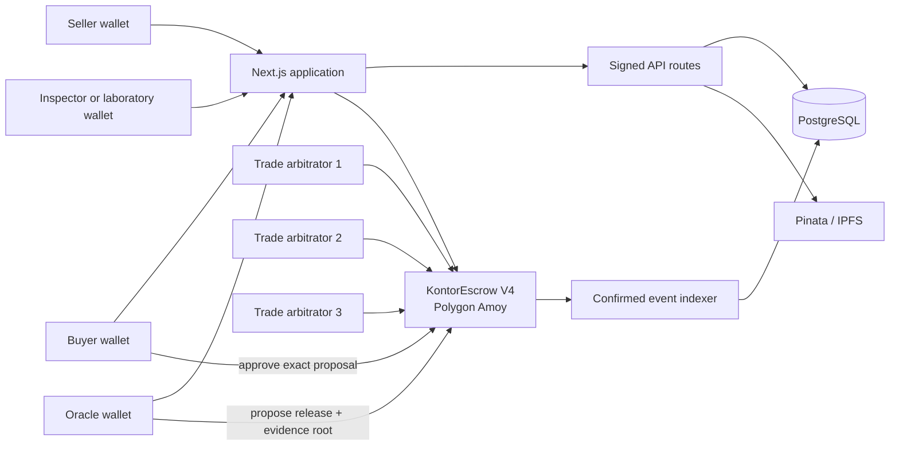

# Kontor21

Kontor21 is a testnet trade-assurance and escrow prototype for agricultural B2B
transactions. It combines a Next.js application, PostgreSQL/Prisma metadata,
IPFS evidence, and a Polygon smart contract with buyer-approved milestone
releases and trade-specific 2-of-3 arbitration.

> **Testnet warning:** The current deployment flow uses `TestUSDC`, a mock token
> with no monetary value. Kontor21 has not completed an independent smart
> contract audit and must not be used with real funds.

## Architecture



The smart contract is a settlement adapter. PostgreSQL and IPFS hold the
structured trade and evidence workflow; the contract controls token custody and
requires separate oracle and buyer actions before a milestone can be paid.

## Settlement security model

1. The seller creates a trade using an allowlisted token.
2. The buyer funds it before the seven-day funding deadline.
3. Approved evidence providers upload documents to IPFS and submit measured
   values to the rules API.
4. The designated oracle proposes an on-chain release for a specific milestone,
   bound by a `proposalId` and a milestone hash, with an amount and evidence root.
5. The buyer must separately approve that exact proposal by its `proposalId`.
6. If no release completes within 30 days of funding, the buyer can recover the
   remaining escrow balance.
7. Either trading party can raise a dispute. Two of the three arbitrators
   snapshotted when the trade was created resolve the remaining balance.

Changing the default arbitrator list affects future trades only. Existing trade
panels cannot be replaced by the owner.

## Trust assumptions and administrative powers

- The buyer controls final approval of normal milestone releases.
- The oracle can propose, but cannot unilaterally transfer funds.
- Evidence validity still depends on the approved provider registry and the
  off-chain rules implementation.
- Three independently controlled arbitrator keys are required. Two can resolve
  a dispute.
- The contract owner can pause new creation, funding, and releases; change the
  token allowlist; and change the default panel for future trades.
- Timeout refunds and dispute resolution remain available during a pause.
- Ownership of the staging escrow is held by a two-day timelock whose proposers
  are two controlled wallets and whose executor is the deployment wallet. A
  multisig before the timelock remains recommended before any non-demo
  deployment.
- Pinata availability is not required to verify an existing CID, but document
  retrieval depends on at least one IPFS provider retaining the content.

## API authentication

Protected API requests use a wallet signature bound to:

- request domain;
- Polygon Amoy chain ID;
- one-time server nonce;
- issuance timestamp and five-minute expiry;
- HTTP method;
- route path;
- exact request body.

The nonce is atomically marked as used before authorization succeeds, preventing
the same captured request from being replayed. Authentication proves wallet
control; each route must still enforce buyer, seller, oracle, provider, or
arbitrator authorization separately.

## IPFS threat model

- A CID proves content identity, not truth, authorship, legality, or quality.
- Provider wallet authorization is checked before evidence is accepted.
- The server calculates a SHA-256 digest and records it in Pinata metadata.
- A malicious or compromised provider can still submit false source data.
- Public IPFS documents must not contain secrets or regulated personal data.
- Availability requires pinning redundancy; the current MVP uses one configured
  Pinata account.
- Certificate revocation cascades to evidence uploaded by the provider; issuer
  signatures, schema versions, and accreditation expiry are known future
  requirements.

## Demo versus implemented functionality

Implemented:

- wallet-signed API mutations with one-time nonces;
- PostgreSQL trade, condition, evidence, and audit records;
- organization memberships with owner, admin, trader, accountant, signer, and
  viewer roles mapped to granular capabilities (trade.create, trade.sign,
  milestone.manage, settlement.approve, evidence.submit, member.manage);
- organization invitation flow: members are invited with a pending status and
  the invited wallet accepts, rejects, or has the manager cancel it;
- organization KYB: an owner/admin submits the organization for verification
  and a platform reviewer approves or rejects it with a recorded reason, wallet,
  and timestamp (UNVERIFIED / PENDING / VERIFIED / REJECTED);
- in-app trade notifications generated from escrow and milestone events, with
  opt-in email/webhook delivery when a delivery endpoint is configured;
- trade milestones, milestone evidence links, and settlement proposal records
  bound to on-chain proposal IDs and milestone hashes;
- versioned milestone rules policies: every policy revision appends an immutable
  rules snapshot (version, authoring wallet, change note) that is immutable
  once the trade is funded;
- a rules engine that evaluates uploaded evidence against a policy condition,
  handling numeric comparisons with comma/dot decimal separators and
  case-insensitive string equality;
- an accredited evidence provider registry with a canonical accreditation issuer
  reference (SGS, Bureau Veritas, ...), validity window, jurisdiction, status,
  and multiple authorized wallets;
- provider accreditation lifecycle: a derived effective status (PENDING /
  ACTIVE / EXPIRED / REVOKED) that honors an elapsed validity window; revocation
  records the actor by wallet, a reason, and a timestamp and cascades the
  terminal status onto every evidence the provider has uploaded;
- text-based document extraction: the evidence upload accepts OCR output or
  document metadata and auto-fills the verified value by parameter, recording
  whether the value was handed in manually or derived automatically;
- confirmed escrow-event indexing with durable cursors and idempotent event keys;
- automatic trade-state reconciliation, dead-letter retries (with an operational
  dead-letter alert), and internal metrics;
- database-backed authentication-challenge rate limiting;
- Pinata/IPFS file upload;
- token allowlist and zero-address validation;
- buyer-approved partial settlement;
- funding and release deadlines;
- timeout refunds;
- per-trade 2-of-3 arbitration;
- emergency pause;
- on-chain escrow ownership via a two-day timelock governance contract;
- interactive no-wallet product demo;
- browser end-to-end tests with a mock wallet.

Prototype or presentation-only:

- market intelligence and AI sourcing content;
- pixel-level OCR engines (text-based document extraction is implemented: a
  provider can supply OCR output or document metadata and the server parses
  the parameter values automatically, recording how the value was derived);
- outbound email and push notification providers (in-app delivery is
  implemented; email/webhook require a configured endpoint);
- legal, user-level KYC, and tax integrations (organization KYB is implemented);

Do not describe the current system as fully decentralized or mathematically
verifying the truth of manually supplied evidence.

## Contract addresses

The files `contract-addresses.json` and `lib/contract-addresses.json` are updated
by the deployment script.

| Environment | Escrow | Token | Explorer |
|---|---|---|---|
| Local Hardhat | Generated per run | TestUSDC | Not applicable |
| Polygon Amoy staging | [`0x5774...58eCB`](https://amoy.polygonscan.com/address/0x5774e6A53A18AD2A7eD2D62e82dF09f364C58eCB) | [`TestUSDC`](https://amoy.polygonscan.com/address/0x1d01314fD9cE3dd52233Bbf86e4f54D7E2221c1C) — no value | Timelock: [`0xf6d4...8a95`](https://amoy.polygonscan.com/address/0xf6d4bc36764A8d2AdB99117b6d04A80ad64e8a95) |
| Polygon mainnet | Not approved | Not approved | Not applicable |

Never copy local Hardhat addresses into staging documentation.

## Local setup

Requirements: Node.js 22+, PostgreSQL, and a Web3 wallet.

```bash
npm ci
copy .env.example .env
npm run db:migrate
npm run dev
```

Required environment variables:

- `DATABASE_URL` — PostgreSQL connection string.
- `PINATA_JWT` — server-only Pinata token with file-pinning permission.
- `AMOY_RPC_URL` — Polygon Amoy RPC endpoint.
- `DEPLOYER_PRIVATE_KEY` — deployment wallet key; never expose it to the browser.
- `POLYGONSCAN_API_KEY` — optional contract-verification key.
- `ARBITRATOR_WALLETS` — three unique controlled addresses, comma-separated.
- `API_CHAIN_ID` — signed API chain binding, `80002` for Amoy.
- `ESCROW_RPC_URL` — server-side RPC used to verify API status changes against the contract.
- `KONTOR_ESCROW_ADDRESS` — deployed escrow address used for server-side verification.
- `ESCROW_NETWORK` — stable indexer network identifier such as `polygon-amoy`.
- `ESCROW_START_BLOCK` — verified contract deployment block.
- `INDEXER_CONFIRMATIONS` — confirmation depth before events are processed.
- `CRON_SECRET` — random bearer token for internal sync and metrics routes.
- `NEXT_PUBLIC_APP_URL` — public application origin.
- `NEXT_PUBLIC_IPFS_GATEWAY` — public IPFS gateway prefix.
- `NOTIFICATION_WEBHOOK_URL` — optional outbound webhook endpoint for pushed
  notification delivery; in-app notifications work without it.

## Quality checks

```bash
npm run lint
npm run typecheck
npm run test:contracts
npm run test:unit
npm test
npx prisma validate
npm run build
```

`npm test` runs the contract suite and the application unit tests for wallet
authentication, internal authorization, organization permissions, and trade
transition authorization. `npm run test:e2e:local` exercises the complete
contract workflow against a separately running local Hardhat node, and
`npm run test:e2e` runs browser end-to-end tests (landing, demo, trust, and the
trade wizard with a mock wallet) against a local `next dev` server. Database
route integration tests remain planned.

## Organization and milestone APIs

All routes below require the same one-time wallet signature described above.

| Method | Route | Purpose |
|---|---|---|
| `GET`, `POST` | `/api/organizations` | List memberships or create an organization |
| `GET`, `POST` | `/api/organizations/:id/members` | List members or invite a new member (pending) |
| `PATCH` | `/api/organizations/:id/members/:membershipId` | Resolve an invitation: accept/reject (invitee) or cancel (manager) |
| `PATCH` | `/api/organizations/:id/kyb` | Submit for KYB review or approve/reject a pending submission |
| `GET`, `PATCH` | `/api/notifications` | List in-app trade notifications or mark them read |
| `GET`, `POST` | `/api/escrow/:id/milestones` | List or allocate pre-funding milestones |
| `PATCH` | `/api/escrow/:id/milestones/:milestoneId` | Update a milestone rules policy (new immutable version) |
| `GET`, `POST` | `/api/escrow/:id/milestones/:milestoneId/settlements` | List or record an on-chain-matched oracle proposal |
| `GET`, `POST` | `/api/evidence-providers` | List providers or register a new accredited provider |
| `PATCH` | `/api/evidence-providers/:id` | Update provider status, accreditation, role, or add a wallet |

Financial amounts are accepted as decimal strings and validated before reaching
the database, avoiding IEEE-754 `Number` precision loss.

Milestone allocations cannot exceed the trade total and become immutable after
funding. Each milestone carries a versioned rules policy: creating a milestone
records rules version 1, and a subsequent `PATCH` appends a new immutable
snapshot (authoring wallet, change note, frozen rule set) and bumps
`rulesVersion`. Like allocations, the policy can no longer change after the
trade is funded. Settlement proposals are accepted only from the designated
oracle and must match the contract's current pending proposal for that
milestone: the API records the on-chain `proposalId` and milestone hash, and
rejects proposals whose amount or evidence root differs from the verified
on-chain state.

Organization member invitations follow a pending flow. `POST
/organizations/:id/members` creates a pending (`INVITED`) membership that has no
trading or administrative access until it is resolved. `GET /organizations`
lists both active memberships and pending invitations the wallet must resolve.
The invited wallet accepts (becomes `ACTIVE`) or rejects (becomes `REVOKED`)
its own invitation; an active owner or admin can cancel a pending invitation
(`REVOKED`). Resolving anything but a pending invitation is rejected.

## Chain indexing and reconciliation

Run a synchronization cycle with:

```bash
npm run chain:sync
```

On Render, schedule `POST /api/internal/chain-sync` with
`Authorization: Bearer $CRON_SECRET`. Each cycle waits for the configured
confirmation depth, resumes from a durable cursor, stores logs under a unique
transaction-hash/log-index key, updates trade and milestone settlement state,
retries dead letters, and reconciles linked database trades against the
contract. Run the operational dead-letter alert with `npm run dlq:alert`: it
emits a `dead_letter_alert_ok` log line and exits `0` when the queue is clean,
or emits `dead_letter_alert` and exits non-zero when events are stale beyond
`DLQ_ALERT_UNRESOLVED_MS` (default 30 min) or retries exceed
`DLQ_ALERT_MAX_RETRIES` (default 5). On Render, schedule it as a cron job
alongside chain-sync and let the exit code drive the job's failure alerting.

Settlement events are matched to database records by the on-chain `proposalId`
(milestone hash and evidence root fall back for pre-V4 records). `ReleaseProposed`
marks the bound settlement `PROPOSED`; `ReleaseCancelled` returns `PROPOSED` or
`APPROVED` settlements to `PENDING`; `ReleaseApproved` marks the bound
settlement `EXECUTED` and rolls the milestone status up to `RELEASED` or
`PARTIALLY_RELEASED`.

Each domain update, processed-event marker, and dead-letter resolution is
committed in one database transaction. A crash cannot persist the domain change
without also marking the corresponding chain event as processed.

`GET /api/internal/metrics` returns failed-event, dead-letter, reconciliation,
and cursor metrics with the same bearer token. Operational logs are emitted as
single-line JSON for ingestion by Render or another log platform.

## Deployment environments

- **Local:** Hardhat, local PostgreSQL, mock TestUSDC.
- **Staging:** Render, managed PostgreSQL, Pinata, Polygon Amoy, TestUSDC.
- **Production:** intentionally undefined until independent audit, multisig owner,
  provider governance, monitoring, incident response, and legal review exist.

`render.yaml` defines the staging web service, PostgreSQL database, migration
command, health check, and secret placeholders. The pre-deploy command runs
`prisma migrate deploy`; application startup never modifies the schema.

Deploy the testnet contracts with:

```bash
npm run deploy:amoy        # escrow + TestUSDC, owner = deployer
npm run deploy:governance  # escrow + TestUSDC + two-day Timelock, owner = timelock
```

`deploy:governance` creates a `TimelockController` with a two-day minimum delay
(`GOVERNANCE_MIN_DELAY_SECONDS`), uses the controlled wallets from
`ARBITRATOR_WALLETS` as proposers, makes the deployer the executor, and
transfers escrow ownership to the timelock. The deployment script writes both
address files. Commit the resulting addresses and add the Polygonscan links
above only after verifying the deployment.

## Recovery procedures

- **Lost deployer/owner key:** there is no recovery for a single-key owner.
  Use a multisig owner before non-demo use.
- **Lost oracle key:** existing funded trades cannot replace their oracle.
  Buyers can use timeout refund or open a dispute. Create future trades with the
  replacement oracle.
- **Lost arbitrator key:** one unavailable arbitrator is tolerated. If the panel
  does not resolve a dispute within 30 days, the buyer can recover the remaining
  balance through the dispute-timeout path.
- **Pinata outage:** retrieve by CID from another gateway and repin the content.
- **Database failure:** restore the managed PostgreSQL backup, rerun migrations,
  then reconcile records against on-chain events before reopening writes.
- **Suspected compromise:** pause the contract, disable deployments, preserve
  logs, rotate server secrets, and publish an incident notice.

## Known limitations

- Owner is enforced on-chain as a two-day timelock on staging; a multisig before
  the timelock is still recommended for any non-demo deployment.
- Arbitration resolves the remaining balance entirely to buyer or seller.
- Milestone rules policies are versioned and immutable after funding, and a
  rules engine evaluates uploaded evidence against a policy version; there is
  no on-chain verification of each evidence provider signature.
- Fine-grained custom permission policies are not implemented (role capabilities
  and the KYB submission/review lifecycle are).
- The indexer is scheduled/polling and must be invoked by Render Cron or an
  equivalent scheduler; it is not a continuously running dedicated worker.
- Reconciliation compares trade settlement state, pending release proposals
  (`proposalId`, milestone hash, amount, evidence root, proposal status), and
  flags stale database proposals missing on-chain. Production-grade historical
  token accounting still requires an external archival data source.
- No independent security audit, formal verification, bug bounty, or SLA.

## Security reporting

Do not disclose suspected vulnerabilities in a public issue. Send a concise
report with reproduction conditions and impact to `info@agrinexus.eu` with the
subject `Kontor21 Security`. Do not include real private keys, seed phrases, or
confidential customer documents.

## Legal disclaimer

Kontor21 is testnet research software, not a bank, custodian, payment institution,
investment service, inspection authority, or legal guarantee. Users remain
responsible for trade contracts, sanctions, KYC/KYB, tax, commodity, data
protection, and payment-law compliance. Testnet tokens have no monetary value.
